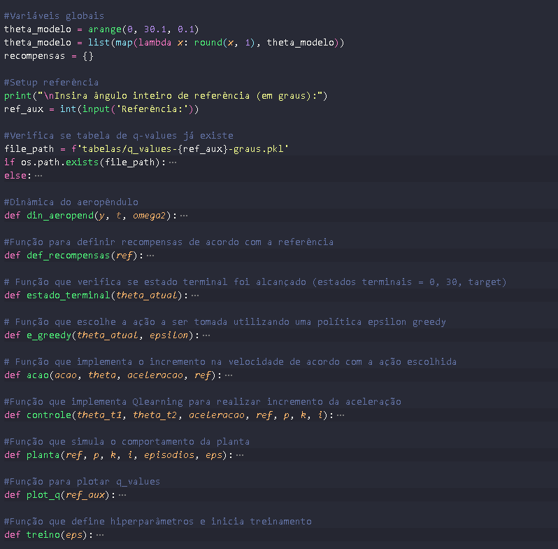
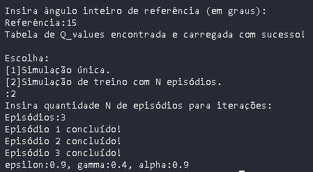
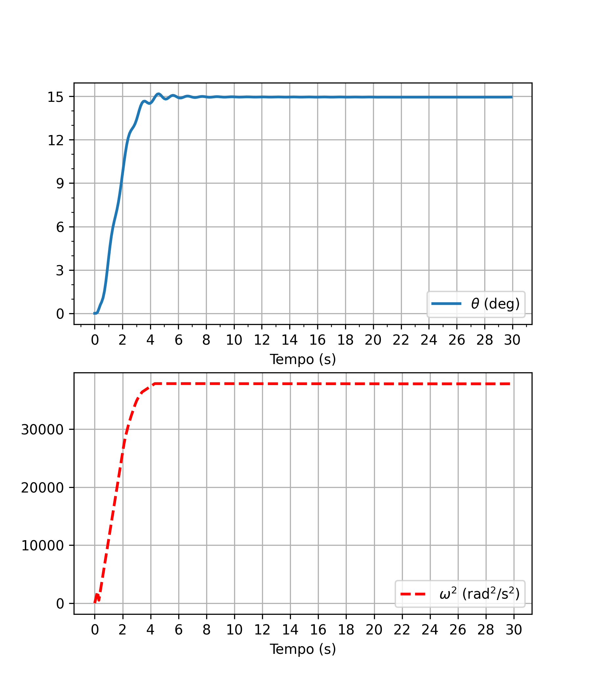
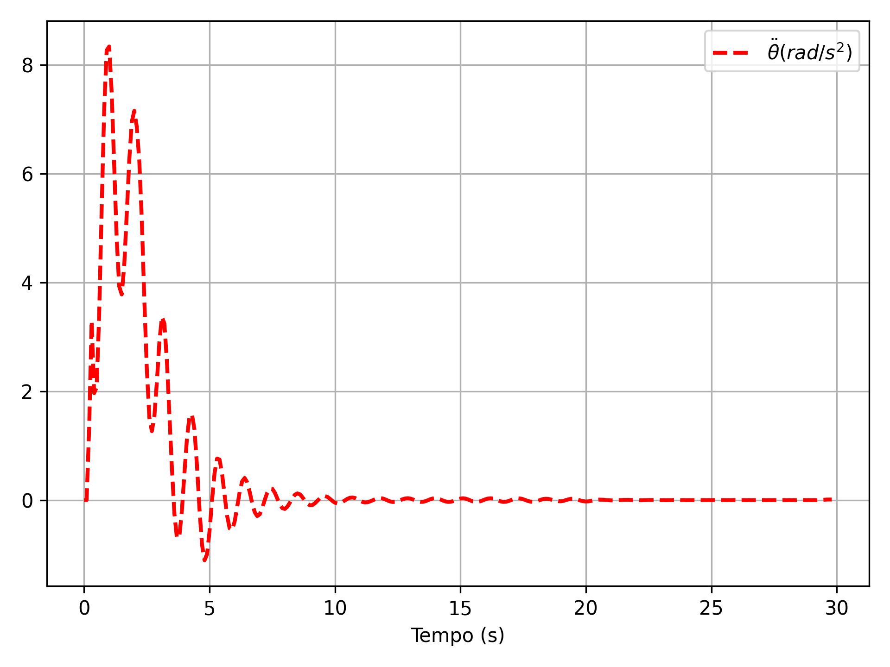
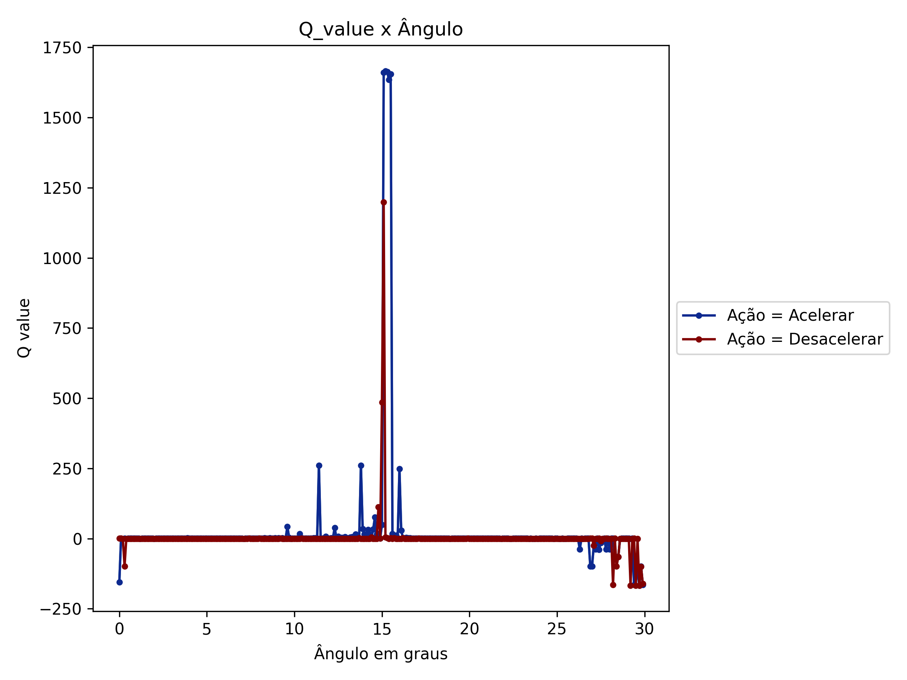

# Projeto de Conclusão de Curso  
## Engenharia Mecatrônica - UFU 

## Objetivos
O objetivo deste projeto é aplicar o método Q-Learning no controle de um aeropêndulo.
Foi utilizado um modelo computacional do aeropêndulo e desenvolvido um agente controlador capaz de aprender (estimando Q-Values) através da interação com o modelo.

## Arquitetura
### Diagrama simplicado

<p align="center">

</p>

### Funções
<p align="center">

</p>


## Utilização

### Pré requisitos

- Python
https://python.org.br/instalacao-windows/
https://python.org.br/instalacao-linux/ 
<br/>

- pip
```
python3 -m pip install --user --upgrade pip
```
<br/>

- Bibliotecas
```
pip install -r requirements.txt
```

### Simulação

```
python3 -m main.py
```


## Exemplo

<p align="center">

</p>

<p align="center">

</p>

<p align="center">

</p>

<p align="center">

</p>
